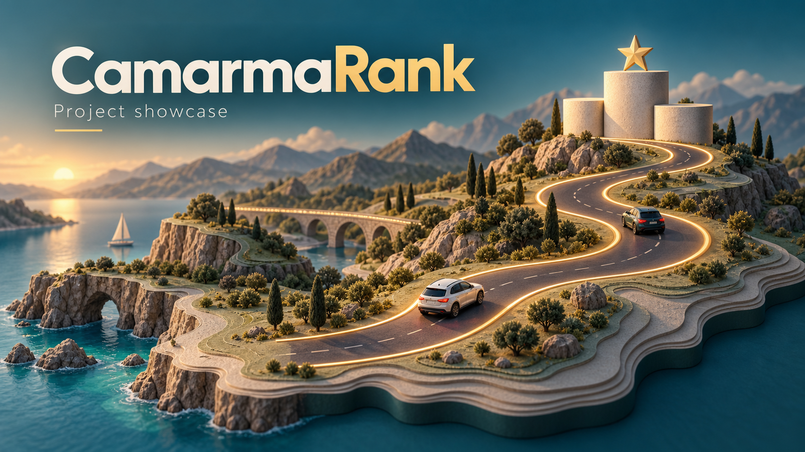
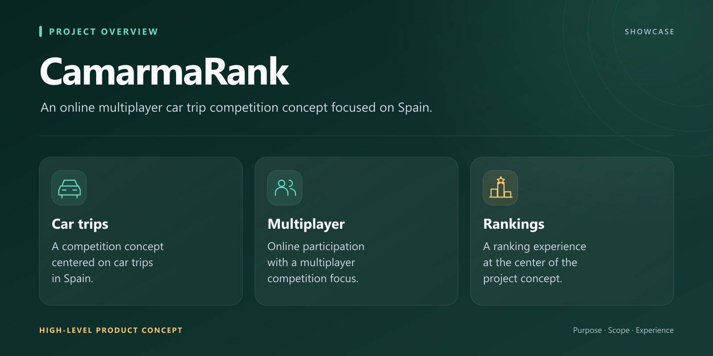
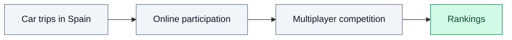

*Concept illustration created for this showcase.*

# CamarmaRank

### Online multiplayer competition for car trips in Spain

A car trip competition app with online multiplayer participation and rankings.

---

## Overview

CamarmaRank brings a competitive element to car trips through an online ranking experience.
The project focuses on multiplayer car trip competition in Spain.

## Project at a glance

| | |
|---|---|
| **Product** | Car trip competition app |
| **Experience** | Online multiplayer participation and rankings |
| **Focus** | Spain |

## Visual overview

## High-level workflow

This conceptual overview reflects the project's car trip competition focus.

## About this repository

This repository is a public showcase. Only presentation material is published; source code and private data remain private.

## Showcase updates

- **2026-09-12:** Added the English project overview and product summary.

---

**Last showcase review:** 2026-09-12 (Europe/Paris).
