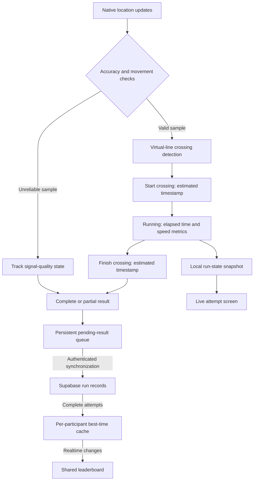
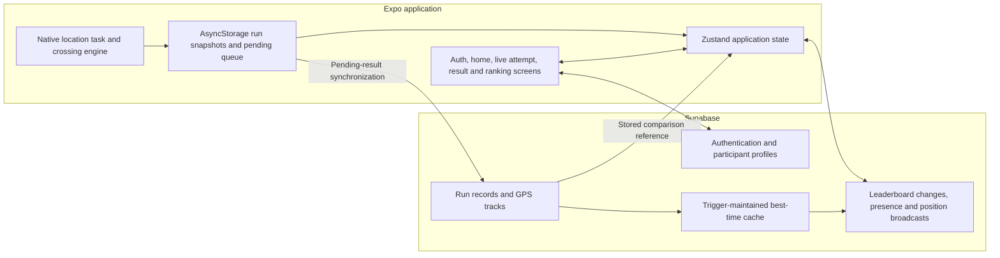

# CamarmaRank

### GPS-timed attempts, shared rankings and a live run dashboard

A mobile-first application that turns a configured route segment into a recorded attempt: detect the start and finish, track elapsed time and speed, save the result, and compare complete attempts on a shared leaderboard.

## What it does

CamarmaRank connects the full lifecycle of a timed attempt. A signed-in participant enters the run screen, the GPS layer waits for a configured start-line crossing, and the interface displays elapsed time, current speed, average speed and maximum speed. Crossing the finish line produces a result that can be synchronized to the shared ranking.

The application distinguishes complete attempts from attempts affected by GPS signal loss. It also retains pending results locally when a connection is unavailable, so the result screen can explain that synchronization is still pending.

## From sign-in to result

| Screen | Role in the experience |
|---|---|
| **Sign in / register** | Email-based accounts, confirmation flow and a username used in the ranking. |
| **Home** | Location-permission handling, entry to a new attempt and access to the leaderboard. |
| **Live attempt** | Waiting-for-start state, GPS accuracy feedback, elapsed time and live speed metrics. |
| **Result** | Final time, average and maximum speed, complete/partial status, synchronization feedback and a repeat action. |
| **Leaderboard** | Ordered participant best times, associated speed/date information and all-time, recent-week and today filter controls. |

## The timing pipeline

The core timing logic works with successive GPS samples and virtual start/finish lines. The crossing calculation tests which side of a line the previous and current samples occupy. When a crossing is detected, it interpolates an estimated timestamp between those samples.

Before a sample can trigger a crossing, the engine checks its reported accuracy and movement speed. Samples that do not meet those checks do not trigger a start or finish. The run state separately records whether the signal became unreliable during the attempt; affected results can be marked partial and kept out of the shared ranking.

The displayed timer has millisecond formatting. That display format is not a claim of independently measured millisecond GPS accuracy.

## Designed around intermittent connectivity

The location task and the interface communicate through local persisted run state. Completed attempts are also placed in a separate persistent queue. On synchronization, the signed-in user's identity is attached and results are submitted to Supabase; entries remain queued if their submission fails.

This separates three concerns: capturing an attempt, showing the result and publishing it to the ranking. The result screen can therefore display a finished attempt even while its online synchronization is pending.

## Rankings and reference comparisons

**The leaderboard stores participant best times.** A database trigger processes complete attempts and maintains a compact per-participant best-time cache. The app subscribes to changes in that cache to refresh the visible ranking. The recent-week and today controls filter the cached best-time entries by their recorded date.

**The run screen includes a comparison layer.** The implementation can load the leading complete attempt's GPS track as a stored reference and exchange active participants' position updates through Supabase Realtime Presence and Broadcast. The current reference-time indicator uses elapsed-time comparison; it is not a validated position-matched pace calculation.

## Application architecture

## Technology stack

| Layer | Technology and responsibility |
|---|---|
| Application | Expo, React Native and TypeScript. |
| Navigation | Expo Router separates authentication and signed-in screens. |
| Styling | NativeWind provides the interface styling. |
| UI state | Zustand manages authentication, active attempts, rankings and reference comparison state. |
| Native tracking | Expo Location and Task Manager handle location updates and the background task. |
| Local persistence | AsyncStorage holds run snapshots and the pending synchronization queue. |
| Backend | Supabase Auth, PostgreSQL and Realtime support accounts, results and shared ranking updates. |
| Web target | React Native Web, configured for deployment on Vercel. |

## Current implementation

The configured web deployment was unavailable at the latest check on 2026-09-12: it returned DEPLOYMENT_NOT_FOUND. The architecture described here is documented from the project implementation; a working public demo is not currently verified.

The source includes the account flow, live attempt and result screens, GPS crossing engine, queued result synchronization, realtime leaderboard and stored/live comparison modules. Native notification hooks and a leader-change notification function are also present; delivery is not represented here as a verified production feature.

Background GPS registration and native notification setup are deliberately excluded from the web platform. The web entry and the native tracking experience therefore have different capabilities.

## About this repository

This repository presents the application and its architecture. Source code, operational settings and participant data remain private.

**Last showcase review:** 2026-09-12 (Europe/Paris).
